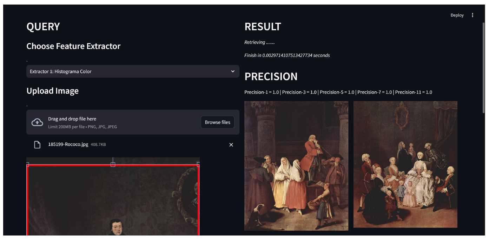
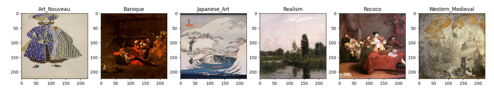
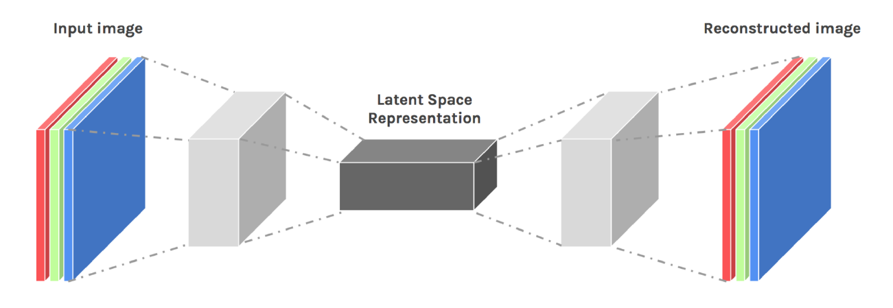
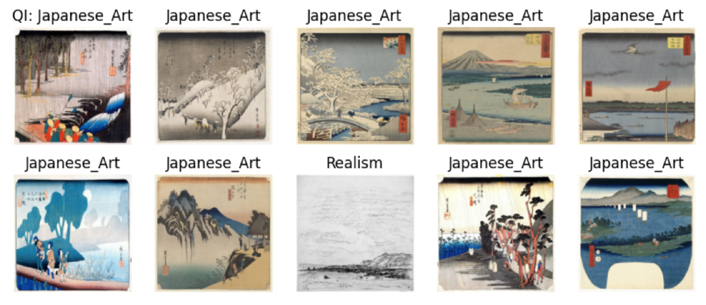

# CONTENT BASED IMAGE RETRIEVAL FOR ART MOVEMENT IDENTIFICATION

This project implements a **Content-Based Image Retrieval (CBIR)** system focused on art movement similarity search. The objective is to retrieve images that belong to the same art movement as the one given as input by using machine learning and different feature extraction techniques.

## Project Preview



## Project Description

The aim of this project is to facilitate an interface that, based on a given work of art image, retrieves similiar images stored in the database based on content. The main objective is to return images that belogn to the same art movement, although we have seen that it is not always the case, as the content of the images is not always related to the artistic style. 

The presented tool allows to select 5 different feature extraction methods, some of them working better than others in specific art movements. Once you have selected the method, you will have to upload an artistic image and you will be able to select the specific area you want the system to take into account.

Once the extraction of images is done you will receive 11 images, along with the corresponding precision related to the number of images returned. Most methods will lose accuracy as the number of matches increases.

## Styles Considered

- `Art Nouveau`
- `Baroque`
- `Japanese Art`
- `Realism`
- `Rococo`
- `Western Medieval`



## Feature Extraction Methods

- `Color Histogram`
- `Texture Histogram`
- `Bag of Words`
- `Convolutional Neural Network (CNN)`: Specifically VGG19.
- `Autoencoder`



## Search Method:

- `Facebook AI Similarity Search (FAISS)`: for fast searches

## Results

As we have seen, the method that obtains the best results is the Autoencoder.

| **EXTRACTOR** | **AVERAGE ACCURACY** |
|:----------:|:-----------:|
| Color Histogram   | 0.65    |
| Texture Histogram   | 0.27    |
| Bag of Words   | 0.44    |
| VGG19   | 0.53    |
| Autoencoder   | 0.83    |

Sample of the results obtained with Autoencoder:



*A deeper analysis of the results obtained is detailed in the report.*

## File Structure

```text
🎨 CONTENT BASED IMAGE RETRIEVAL FOR ART MOVEMENT IDENTIFICATION
├── 📁 Code
│   ├── 📁 database Folder
│   │       → Folder with the files used to work with the image database and the indexes.
│   ├── Bag_Of_Words.npy
│   │       → Contains the visual words dictionary used in Extractor 3 (Bag of Words).
│   ├── Dataset Arte.zip
│   │       → Contains all the images used, organized by art movements.
│   ├── DatasetArteTrainTest.zip
│   │       → Contains the images already split into Train and Test sets with renamed files.
│   ├── Extractor1-HistogramaColor.ipynb
│   │       → Notebook with the process followed to generate indexes using Color Histograms.
│   ├── Extractor2-Texturas.ipynb
│   │       → Notebook with the process followed to generate indexes using Texture features.
│   ├── Extractor3-BagOfWords.ipynb
│   │       → Notebook implementing Bag-of-Words and generating its corresponding indexes.
│   ├── Extractor4-CNN-VGG19.ipynb
│   │       → Notebook with the feature extraction process using CNN VGG-19.
│   ├── Extractor5-Autoencoder.ipynb
│   │       → Notebook that trains the Autoencoder and generates the indexes for Extractor 5.
│   ├── Interfaz.py
│   │       → Contains the interface code used to perform CBIR queries.
│   ├── PreprocesadoImagenes.ipynb
│   │       → Contains the process of dataset splitting and database creation.
│   ├── Resultados.ipynb
│   │       → Contains the calculations performed to extract and evaluate the results.
│   ├── ResultadosCBIR.xlsx
│   │       → Contains the results obtained for all test images.
│   └── autoencoder.keras
│           → Contains the trained Autoencoder model used in Extractor 5.
├── 📁 Images
│       → Folder containing example images stored for visualization or demonstration.
├── 📄 README.md
│       → Documentation of the project.
└── 📄 CBIR_Report.pdf
        → Full report of the preprocessing steps, extractor implementations, and obtained results.
```

The contents are only available in spanish.

## Execution

- To run the project, simply execute the file `Interfaz.py`, which contains the interface code.  
- Execution command: `py -m streamlit run interfaz.py`   
- Sample images to use in the interface are available in the `Test` folder of `DatasetArteTrainTest.zip`.      

Download all files and store them in the same folder. Otherwise, modify the file paths in the main code and run it.

## Requirements

- Python 3.7 or higher
- Keras version used: 3.7.0 

## Dataset

- **Source**: Reduced dataset from [WikiArt Art Movements/Styles](https://www.kaggle.com/datasets/sivarazadi/wikiart-art-movementsstyles)

## Authors

- [Fátima Fuchun Illana Guerra](https://github.com/Fatima-Illana)
- [Cristina Fernández Gómez](https://github.com/crisfernandez)
- [Ester Esteban Bruña](https://github.com/esteresteban)

## Interface Code Author

- [Ángel Mario García Pedrero](https://github.com/amgp-upm)
